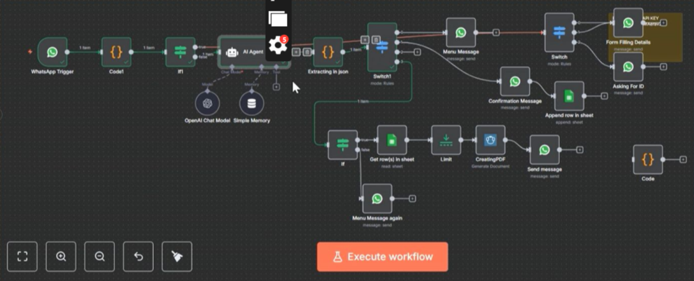

# AI Lead Generation & Outreach Automation Platform

An AI-powered lead generation platform built using **n8n, AI Agents, Python, web scraping, and intelligent workflow automation**.

The system automatically discovers business opportunities, validates website data, analyzes translation quality, scores leads, generates AI-powered insights, creates personalized outreach emails, and manages everything from a centralized dashboard.

> **Note:** The original workflow JSON is intentionally not included because this project was developed for a client. This repository demonstrates the workflow architecture, execution, and results while protecting client confidentiality.

---

# Project Overview

This project started as a simple lead scraping workflow but evolved into a complete AI-powered automation ecosystem where multiple intelligent workflows collaborate to discover, validate, analyze, and qualify business opportunities.

Instead of manually researching companies, checking websites, validating translations, and writing outreach emails, the entire process is automated through AI and workflow orchestration.

---

# Business Problem

Sales teams spend significant time:

- Finding companies
- Researching websites
- Checking multilingual support
- Validating translation quality
- Identifying business opportunities
- Writing personalized cold emails
- Managing outreach campaigns

These repetitive tasks slow down business growth and reduce efficiency.

---

# Solution

This platform automates the complete lead generation pipeline.

Users upload a spreadsheet (or provide a website), and the system automatically:

- Scrapes company websites
- Detects languages
- Analyzes website traffic
- Validates translation pages
- Scores translation quality
- Identifies opportunities
- Generates AI insights
- Creates personalized outreach emails
- Tracks every workflow through a centralized dashboard

---

# Platform Modules

## Lead Scraper

Automatically processes uploaded Excel files and extracts valuable business information.

Features:

- Excel upload
- Website discovery
- Company information extraction
- Country detection
- Traffic analysis
- Language detection
- Opportunity discovery

---

## Translation Qualification Engine

An AI-powered workflow that evaluates multilingual websites.

Features:

- Translation quality evaluation
- Link validation
- AI scoring
- Opportunity identification
- Translation recommendations

---

## Single Website Checker

Quick analysis tool for individual websites.

Simply provide a URL and receive:

- Website analysis
- Translation validation
- AI qualification score
- Opportunity report

---

## Translation URL Validation Engine

One of the most advanced components of the platform.

For every website the workflow:

- Generates approximately 25 possible translation URLs
- Visits every page automatically
- Detects valid translations
- Removes false positives
- Identifies actual multilingual support

This significantly improves data accuracy.

---

## AI Summary Engine

Converts raw website data into meaningful business insights.

Provides:

- Opportunity scores
- Website summaries
- Translation quality reports
- Decision-ready recommendations

---

## AI Email Generator

Automatically creates personalized outreach emails based on the discovered opportunities.

Each email is generated using:

- Company information
- Website analysis
- Translation gaps
- Business opportunities

---

## Centralized Dashboard

A complete management interface for the automation platform.

Users can:

- Upload Excel files
- Analyze individual websites
- Track workflow progress
- Monitor successful and failed jobs
- View detailed error logs
- Analyze traffic by country
- Review generated emails
- Approve emails before sending

Once approved, the workflow automatically sends personalized outreach emails.

---

# Workflow Architecture



---

# Platform Workflow

```
Excel Upload / Website URL

            │

            ▼

Lead Scraper

            │

            ▼

Website Analysis

            │

            ▼

Traffic Analysis

            │

            ▼

Language Detection

            │

            ▼

Translation Validation

            │

            ▼

AI Qualification

            │

            ▼

Opportunity Scoring

            │

            ▼

AI Summary

            │

            ▼

Email Generation

            │

            ▼

Dashboard Approval

            │

            ▼

Automatic Email Sending
```

---

# Key Features

- AI-powered lead generation
- Automated website scraping
- Translation quality analysis
- Country-based traffic analysis
- Opportunity scoring
- Intelligent URL validation
- Personalized email generation
- Centralized dashboard
- Workflow monitoring
- Failure tracking
- Retry mechanisms
- Detailed logging
- Smart error handling

---

# Error Handling

The platform includes enterprise-level resilience.

Features include:

- Automatic retries
- Failure tracking
- Detailed error logs
- Validation checks
- Workflow recovery
- Exception handling

---

# Tech Stack

## Automation

- n8n

## AI

- OpenAI
- AI Agents
- Large Language Models (LLMs)

## Web Scraping

- HTTP Requests
- Website Crawling
- Data Extraction

## APIs

- REST APIs

## Dashboard

- Custom Dashboard
- Workflow Monitoring

## Programming

- Python
- JavaScript

---

# Repository Contents

```
assets/
│
├── workflow.png
├── Leads_explanation_video.mp4
├── Explanation_01.mp4
├── Explanation_02.mp4
├── Single_website_checker_explanation.mp4
├── Translation_Qualification_explanation.mp4
├── URL_Variations.mp4

README.md
```

---

# Workflow Demonstrations

## Lead Generation Overview

📹 `assets/Leads_explanation_video.mp4`

Complete overview of the AI lead generation platform and workflow.

---

## Workflow Architecture

📹 `assets/Explanation_01.mp4`

Explains the overall workflow architecture and system design.

---

## Dashboard & Automation

📹 `assets/Explanation_02.mp4`

Demonstrates the dashboard, workflow execution, and automation logic.

---

## Single Website Checker

📹 `assets/Single_website_checker_explanation.mp4`

Shows how an individual website is analyzed and qualified.

---

## Translation Qualification Engine

📹 `assets/Translation_Qualification_explanation.mp4`

Explains AI-powered translation quality evaluation and opportunity scoring.

---

## URL Validation Engine

📹 `assets/URL_Variations.mp4`

Demonstrates how the workflow generates and validates multiple translation URLs to eliminate false positives.

---

# Business Impact

This automation helps businesses:

- Generate qualified leads automatically
- Reduce manual research
- Validate multilingual websites
- Improve data accuracy
- Personalize outreach at scale
- Save hundreds of hours of manual work
- Increase sales efficiency
- Centralize workflow management

---

# Privacy Notice

The original workflow JSON is **not included** because it was developed for a real client.

This repository shares workflow documentation, demonstrations, architecture diagrams, and implementation details while protecting client confidentiality.

---

# Author

**Rimsha Zainab**

AI Automation Engineer

### Specializations

- AI Agents
- n8n Automation
- Workflow Automation
- Web Scraping
- Lead Generation Systems
- OpenAI
- Python
- Playwright
- API Integrations
- Business Process Automation

**LinkedIn**

https://linkedin.com/in/rimsha-zainab-9b273628b

**GitHub**

https://github.com/Rimsha13
